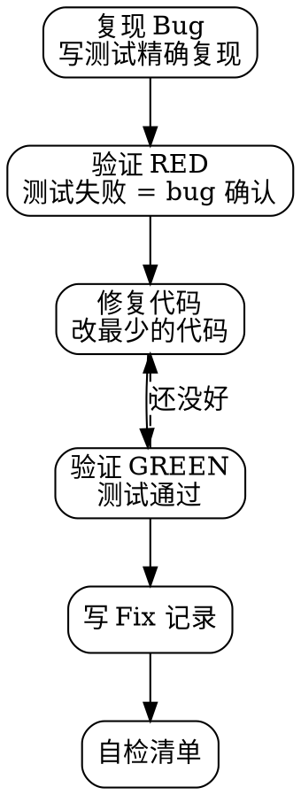

# cm-dev:fix — Bug 修复

## 工作流



## Bug 修复必须走 TDD

1. **复现 Bug** — 写一个测试精确复现 bug 场景
2. **验证 RED** — 运行测试确认它失败（证明 bug 确实存在）
3. **修复代码** — 改最少的代码
4. **验证 GREEN** — 运行测试确认通过，测试永久保留作回归用例

## 排查优先级

| 优先级 | 症状 | 快速检查 |
|--------|------|----------|
| P0 | import 破损 | 重命名/删文件后引用没更新 |
| P1 | 空值/undefined 传递 | `.shadow(undefined)`、`.width(undefined)` 等 |
| P2 | ArkTS 语法违规 | `any`、`for...in`、class as obj、Divider in ForEach |
| P3 | V1 decorator 误用 | 用了 `@State`/`@Prop` 而非 V2 |
| P4 | 主题响应式断链 | `isDark` 没传下去 |
| P5 | 编译产物缓存问题 | `hvigorw clean` 后再试 |

## Fix 记录模板

落地到 `docs/superpowers/fixes/YYYY-MM-DD-<bug>-fix.md`：

```markdown
# [Bug 名] 修复记录

## 症状
- 编译报错 / 运行时崩溃 / UI 异常
- 错误信息：xxx

## 根因
- 一句话说明为什么出问题

## 修复方式
- 改了哪些文件、改了啥

## 预防措施
- 以后如何避免同类问题

## 相关 commit
```

## 修复后清单

- [ ] Bug 复现测试已保留（TDD RED → GREEN）
- [ ] Fix 记录写入 `docs/superpowers/fixes/`
- [ ] INDEX.md 已更新
- [ ] `[IMPORTANT]` 日志标记已加
- [ ] 涉及组件渲染 → 确认 Demo 页面 UI 正常
- [ ] 编译验证通过

## 引导到下一步

修复后使用 `cm-dev:verify` 执行完整自检。
