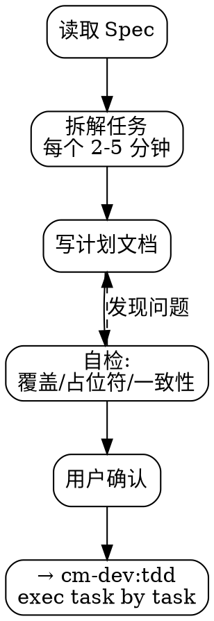

# cm-dev:plan — 实施计划

**前置条件：** 已有确认的 Spec。

## 工作流



## 原则

- 每步 2-5 分钟，一次一个动作
- 每步必须有完整代码（没有 "TBD" / "TODO"）
- 每个文件路径必须精确
- 每个命令必须有预期输出
- 不要写出任何占位符

## 计划模板

落地到 `docs/superpowers/plans/YYYY-MM-DD-<feature>.md`：

```markdown
# [Feature] Implementation Plan

**Goal:** 一句话描述
**Architecture:** 2-3 句架构说明
**Tech Stack:** HarmonyOS / ArkTS / ark-uikit

---

### Task 1: [组件/模块名]

**Files:**
- Create: `uikit/src/main/ets/components/xxx/CmXxx.ets`
- Modify: `uikit/src/main/ets/Index.ets`
- Test: `entry/src/ohosTest/ets/test/Components.test.ets`

- [ ] Step 1: 写失败测试
  ```typescript
  it('test_name', 0, () => { ... })
  ```

- [ ] Step 2: 运行确认测试失败
  `hvigorw assembleHap` → FAIL

- [ ] Step 3: 写最简实现

- [ ] Step 4: 运行确认通过
  `hvigorw assembleHap` → BUILD SUCCESSFUL

- [ ] Step 5: 自检 + 提交
```

## 自检

1. **Spec 覆盖** — Spec 里每项需求都能对应到某 Task？
2. **占位符扫描** — 全文搜索 TBD/TODO/占位符？
3. **类型一致性** — 所有 Task 间的签名一致？

## 红标

| 想法 | 现实 |
|------|------|
| "先写实现再补计划" | 计划是路线图，没有路线图就会迷路 |
| "Task 拆分太细了" | 2-5 分钟一个 Task 是经过验证的节奏 |
| "这里留个 TODO 后面再补" | TODO = 永远不会做 |
| "文件路径差不多就行了" | 路径错了整个计划白费 |

## 引导到下一步

计划确认后，逐 Task 使用 `cm-dev:tdd` 执行。每个 Task 一轮 RED-GREEN-REFACTOR。
