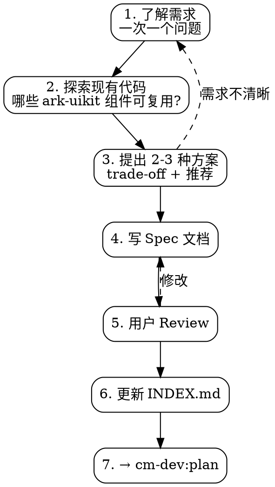

# cm-dev:spec — Spec-First 设计

**前置条件：** 用户已确认需要设计文档。

## 工作流



## 流程

### 1. 了解需求

一次 1 个问题，理解目的/约束/成功标准。已清晰则跳过。

### 2. 探索现有代码

检查哪些 ark-uikit 组件可以直接复用。

### 3. 提出 2-3 种方案

含 trade-off 和推荐。用户确认后进入步骤 4。

### 4. 写 Spec 文档

落地到 `docs/superpowers/specs/YYYY-MM-DD-<feature>-design.md`：

```markdown
# [Feature] 设计文档

## 背景与目标
- 为什么做这个？解决什么问题？

## 用户流程
- 用户操作路径、关键交互

## 数据结构
- 接口定义（ArkTS interface/class）、字段说明

## UI 设计
- **标注使用的 ark-uikit 组件**（如：基于 CmButton + CmDialog）
- 布局结构、主题 token 使用

## 错误处理
- 边界情况、空状态、异常兜底

## 验收标准
- 什么算做完？
```

### 5. Spec 自检

- [ ] 没有 "TBD" / "TODO" / 空段落
- [ ] 架构与功能描述不自相矛盾
- [ ] 范围聚焦，一次 Plan 能完成
- [ ] 描述没有二义性

### 6. 更新 INDEX.md

```markdown
- YYYY-MM-DD — [Spec] 标题 — 一句话摘要
```

### 7. 引导到下一步

用户确认后引导使用 `cm-dev:plan`。

## 红标

| 想法 | 现实 |
|------|------|
| "需求很清楚，直接写就行了" | Spec 是设计决策记录，不是需求文档 |
| "先写着，TBD 后面补" | TBD = 没想清楚，需要停下来想 |
| "Spec 太长没人看" | 聚焦核心决策，3-5 段就够了 |
