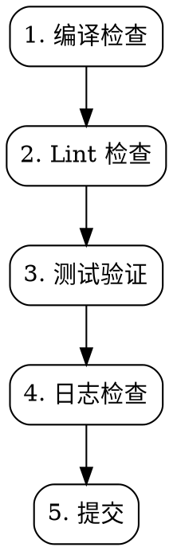

# cm-dev:verify — 自检验证

**规则：** 未完成自检 = 不能声明完成。使用 TaskCreate 逐项跟踪。

## 工作流



## 1. 编译检查

```bash
HVIGOR_BIN=""
if command -v hvigor &>/dev/null; then
    HVIGOR_BIN="hvigor"
elif [ -f "/Applications/DevEco-Studio.app/Contents/tools/hvigor/bin/hvigorw" ]; then
    HVIGOR_BIN="/Applications/DevEco-Studio.app/Contents/tools/hvigor/bin/hvigorw"
fi

if [ -n "$HVIGOR_BIN" ]; then
    "$HVIGOR_BIN" --mode module -p module=entry -p product=default assembleHap
    if [ $? -eq 0 ]; then
        "$HVIGOR_BIN" --mode module -p module=uikit -p product=default assembleHar
    fi
fi
```

- [ ] 所有 `import` 引用路径正确
- [ ] 新增文件在正确的目录结构下
- [ ] 删除/重命名文件后引用已更新

## 2. Lint 检查

- [ ] 缩进统一 2 空格
- [ ] camelCase 变量 / PascalCase 类型接口
- [ ] 无 `console.*` 直出（用 Logger）
- [ ] 无 `any` 类型滥用
- [ ] 无未使用的变量
- [ ] 无悬浮的 `Promise`
- [ ] 所有方法/参数/返回值有完整类型标注

## 3. 测试验证

- [ ] 每个新函数/方法有对应测试
- [ ] 每轮 TDD 都验证了 RED
- [ ] 所有测试通过
- [ ] 边缘情况有覆盖
- [ ] 修改组件时同步更新了测试

## 4. 日志检查

- [ ] 新增/修改的关键路径有入口/出口/中间状态日志
- [ ] 已知问题点加了 `[IMPORTANT]` 标记
- [ ] catch 块包含异常消息 + 当前上下文

## 5. 提交

每次 TDD cycle 完成提交一次：

```bash
git add <测试文件> <实现文件>
git commit -m "feat: add XXX — RED/GREEN/REFACTOR"
```

提交信息格式：
- `feat: add XXX — RED/GREEN/REFACTOR`（功能）
- `fix: fix XXX`（Bug 修复）
- `refactor: improve XXX`（重构）

## 红标

| 想法 | 现实 |
|------|------|
| "编译通过了，不用检查别的" | 编译通过 ≠ 代码质量过关 |
| "Lint 后面统一跑" | 延迟检查 = 从不检查 |
| "测试先跳过，回头补" | 回头补的测试证明不了任何事 |
